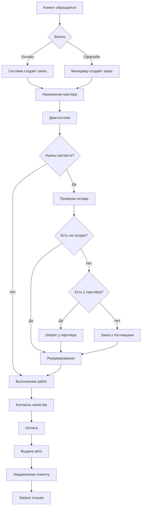
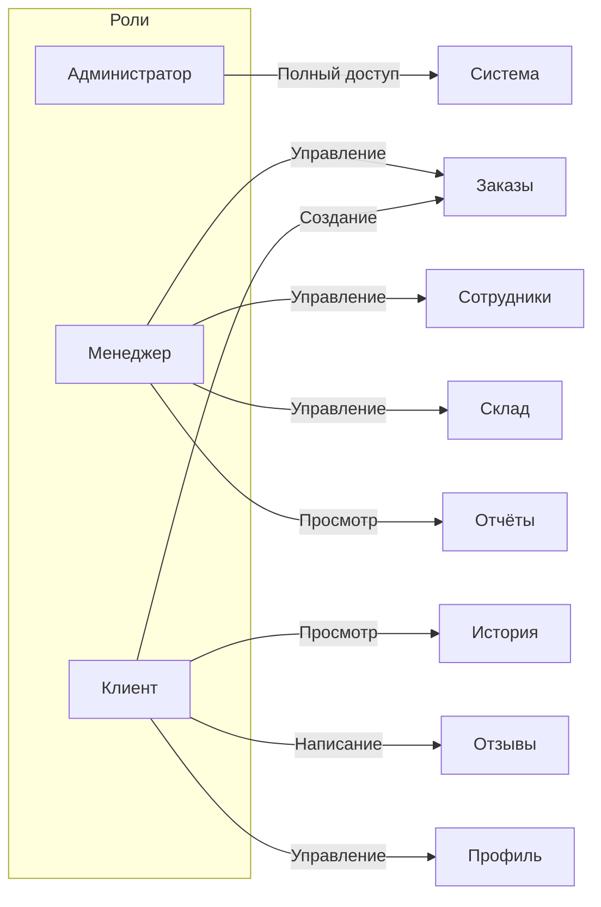
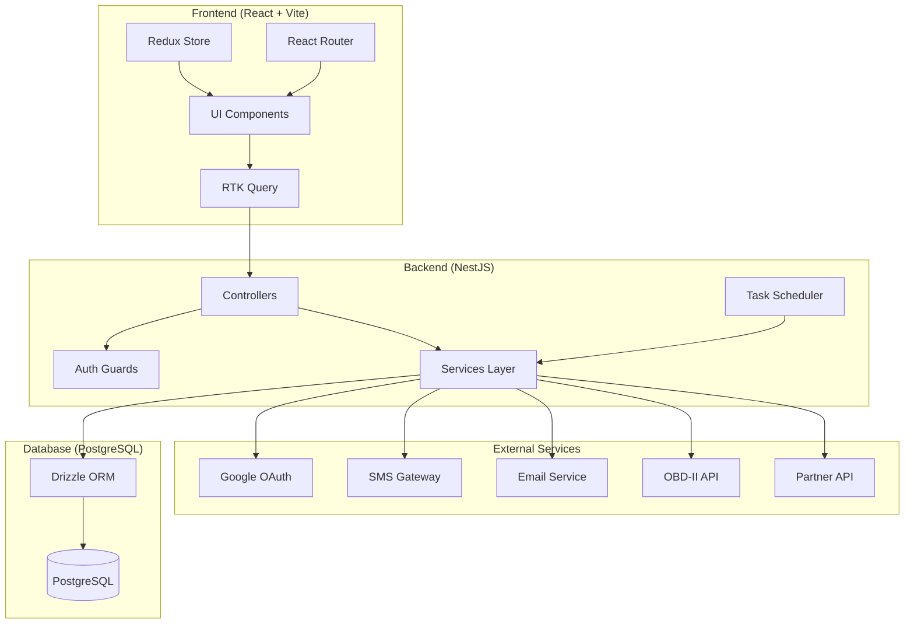
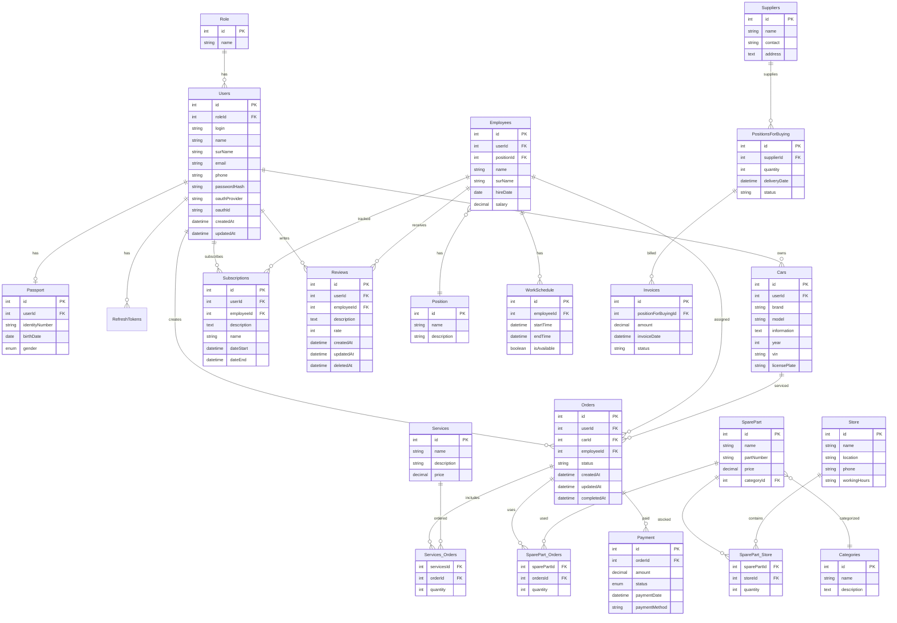
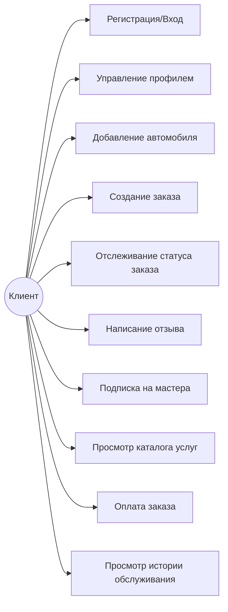
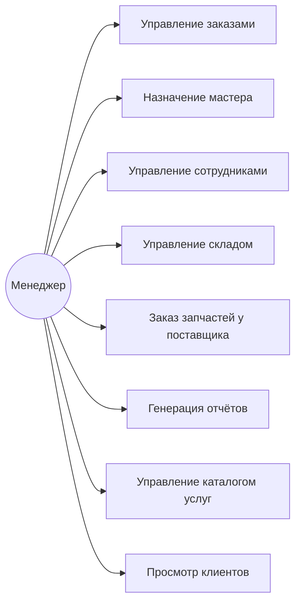
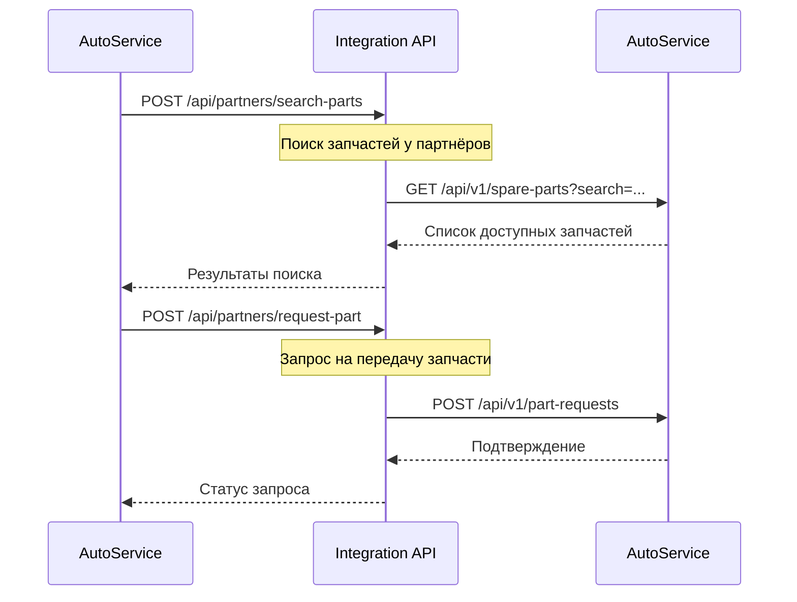
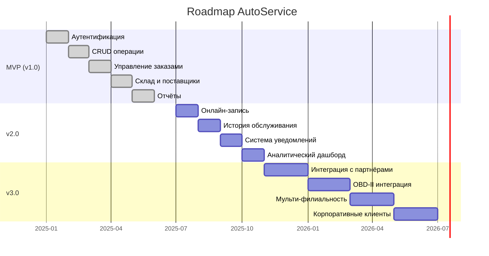

# Бизнес-требования: Автоматизированная система управления автосервисом (AutoService)

## 1. Введение

### 1.1 Назначение документа

Настоящий документ определяет бизнес-требования к автоматизированной системе управления автосервисом **AutoService**. Система предназначена для комплексной автоматизации всех бизнес-процессов автосервиса — от приёма заказов и управления сотрудниками до учёта запасных частей и интеграции с партнёрскими автосервисами.

### 1.2 Актуальность

Рынок автосервисных услуг в СНГ характеризуется:
- Высокой долей ручного управления бизнес-процессами (до 70% автосервисов)
- Отсутствием единого стандарта обмена данными между автосервисами
- Потерями до 15-20% потенциального дохода из-за неэффективного управления складом и расписанием
- Низким уровнем удержания клиентов из-за отсутствия CRM-инструментов

AutoService решает эти проблемы через единую платформу, которая:
- Автоматизирует внутренние процессы автосервиса
- Предоставляет клиентам онлайн-доступ к услугам
- Обеспечивает интеграцию между автосервисами через открытый API

### 1.3 Стейкхолдеры

| Роль | Интерес |
|------|---------|
| Владелец автосервиса | Увеличение прибыли, контроль бизнеса |
| Менеджер | Управление заказами, сотрудниками, складом |
| Мастер (сотрудник) | Получение заказов, управление расписанием |
| Клиент | Онлайн-запись, отслеживание статуса ремонта |
| Партнёр-автосервис | Обмен запчастями, перенаправление клиентов |

---

## 2. Описание предметной области

### 2.1 Бизнес-процессы автосервиса

### 2.2 Текущие сущности системы

| Сущность | Описание |
|----------|----------|
| Users | Пользователи системы (клиенты, менеджеры, админы) |
| Employees | Сотрудники автосервиса (мастера, диагносты) |
| Cars | Автомобили клиентов |
| Orders | Заказ-наряды на выполнение работ |
| Services | Каталог услуг автосервиса |
| SparePart | Каталог запасных частей |
| Store | Склады запасных частей |
| Suppliers | Поставщики запчастей |
| Subscriptions | Подписки клиентов на уведомления |
| Reviews | Отзывы клиентов о работе сотрудников |
| Payment | Информация об оплате заказов |

---

## 3. Роли пользователей

### 3.1 Диаграмма ролей

### 3.2 Матрица доступа

| Функция | Admin | Manager | Customer |
|---------|-------|---------|----------|
| Управление пользователями | + | Просмотр | - |
| Управление сотрудниками | + | + | - |
| Создание заказов | + | + | + (свои) |
| Просмотр всех заказов | + | + | - |
| Управление складом | + | + | - |
| Управление поставщиками | + | + | - |
| Генерация отчётов | + | + | - |
| Написание отзывов | - | - | + |
| Управление профилем | + | + | + |
| Интеграция с партнёрами | + | - | - |

---

## 4. Функциональные требования

### 4.1 Реализованные функции (MVP)

#### FR-001: Аутентификация и авторизация
- Регистрация по email/password
- Вход через OAuth 2.0 (Google)
- JWT access/refresh token система
- Ролевая модель доступа (admin, manager, customer)

#### FR-002: Управление пользователями
- CRUD операции для пользователей
- Профиль пользователя с возможностью редактирования
- Управление автомобилями пользователя (добавление, редактирование, удаление)

#### FR-003: Управление сотрудниками
- CRUD операции для сотрудников
- Должности и зарплаты
- Рабочее расписание с автоматическим обновлением доступности (cron каждые 5 минут)
- Подписка клиентов на уведомления о доступности мастера

#### FR-004: Управление заказами
- Создание заказ-наряда (клиент, авто, мастер)
- Привязка услуг и запчастей к заказу
- Статусы заказа: pending → in_progress → completed / cancelled
- Фильтрация, сортировка, пагинация

#### FR-005: Каталог услуг
- CRUD операции для услуг
- Название, описание, цена

#### FR-006: Управление складом
- Каталог запчастей с категориями
- Несколько складов (Store)
- Учёт количества на каждом складе (SparePart_Store)

#### FR-007: Управление поставщиками
- CRUD операции для поставщиков
- Позиции для закупки (PurchaseOrders)
- Счета-фактуры (Invoices)

#### FR-008: Оплата
- Запись оплаты за заказ
- Метод оплаты, сумма, статус

#### FR-009: Отзывы
- Создание отзывов о сотрудниках
- Рейтинг (1-5)
- Soft delete

#### FR-010: Отчёты
- Отчёт по заказам клиентов
- Отчёт по запасам на складах
- Отчёт по доходам от услуг
- Отчёт по работе сотрудников
- Отчёт по подпискам и отзывам

### 4.2 Планируемые функции (v2.0)

#### FR-011: Онлайн-запись
- Клиент выбирает услугу, дату, время, мастера
- Система проверяет доступность мастера по расписанию
- Автоматическое создание заказа
- Подтверждение по email/push

#### FR-012: История обслуживания автомобиля
- Полная история всех работ по VIN
- Рекомендации по ТО на основе пробега/времени
- Автоматические напоминания о плановом ТО

#### FR-013: Система уведомлений
- Email уведомления (изменение статуса заказа, завершение ремонта)
- Push-уведомления в браузере
- SMS-уведомления (интеграция с SMS-шлюзом)
- Напоминания о плановом ТО

#### FR-014: Интеграция с OBD-II
- Считывание кодов ошибок через OBD-II адаптер
- Автоматическое определение неисправностей
- Рекомендации по ремонту на основе кодов ошибок
- Сохранение результатов диагностики в истории авто

#### FR-015: Мульти-филиальность
- Управление несколькими точками автосервиса
- Общий каталог услуг и запчастей
- Перемещение запчастей между складами
- Консолидированная отчётность

#### FR-016: Интеграция с партнёрскими автосервисами
- REST API для обмена данными между автосервисами
- Поиск запчастей у партнёров
- Перенаправление клиентов (если нет нужной услуги)
- Совместные акции и программы лояльности

#### FR-017: Аналитический дашборд
- KPI в реальном времени (выручка, загрузка, средний чек)
- Графики трендов (динамика заказов, доходов)
- Прогнозирование загрузки на основе исторических данных
- ABC-анализ услуг и запчастей

#### FR-018: Гарантийное отслеживание
- Гарантия на выполненные работы
- Гарантия на установленные запчасти
- Автоматическое уведомление об окончании гарантии
- Учёт гарантийных случаев

#### FR-019: Корпоративные клиенты
- Управление автопарком компании
- Корпоративные тарифы и скидки
- Выделенный менеджер
- Ежемесячная сводная отчётность для корпоративных клиентов

---

## 5. Нефункциональные требования

### 5.1 Производительность
- Время ответа API: < 200ms для 95% запросов
- Поддержка до 100 одновременных пользователей
- Время загрузки страницы: < 2 секунды

### 5.2 Безопасность
- HTTPS для всех соединений
- JWT с коротким TTL access token (15 мин) и длинным refresh token (7 дней)
- Хэширование паролей (bcrypt, salt rounds >= 10)
- Валидация входных данных на стороне сервера (class-validator)
- Защита от SQL-инъекций (Drizzle ORM параметризованные запросы)
- CORS настройки для разрешённых доменов
- Rate limiting для API

### 5.3 Надёжность
- Резервное копирование БД (ежедневно)
- Логирование ошибок
- Graceful degradation при недоступности внешних сервисов

### 5.4 Масштабируемость
- Микросервисная архитектура (готовность к разделению)
- Stateless backend (готовность к горизонтальному масштабированию)
- Docker-контейнеризация

### 5.5 Удобство использования
- Responsive дизайн (мобильные устройства, планшеты, десктоп)
- Локализация на русском языке
- Интуитивный интерфейс (не более 3 кликов до целевого действия)

---

## 6. Архитектура системы

### 6.1 Общая архитектура

### 6.2 Стек технологий

| Компонент | Технология | Версия |
|-----------|-----------|--------|
| Frontend | React | 19.x |
| State Management | Redux Toolkit + RTK Query | 2.x |
| CSS Framework | Tailwind CSS | 4.x |
| Forms | React Hook Form + Zod | 7.x / 4.x |
| Build Tool | Vite | 6.x |
| Backend | NestJS | 11.x |
| ORM | Drizzle ORM | 0.44.x |
| Database | PostgreSQL | 16.x |
| Auth | JWT + Passport.js + Google OAuth | - |
| Containerization | Docker + Docker Compose | - |

---

## 7. ER-диаграмма базы данных

---

## 8. Use-Case диаграммы

### 8.1 Основные сценарии клиента

### 8.2 Основные сценарии менеджера

---

## 9. Интеграция с партнёрскими автосервисами

### 9.1 Концепция API Federation

AutoService предоставляет открытый REST API для интеграции между автосервисами-партнёрами.

### 9.2 Сценарии интеграции

1. **Обмен запчастями** — поиск редких запчастей у партнёров, запрос на передачу
2. **Перенаправление клиентов** — если услуга недоступна, перенаправление к партнёру
3. **Совместные акции** — единые программы лояльности
4. **Обмен экспертизой** — рекомендации специалистов между автосервисами

### 9.3 API эндпоинты для интеграции

| Метод | Endpoint | Описание |
|-------|----------|----------|
| GET | `/api/partners` | Список партнёров |
| POST | `/api/partners/register` | Регистрация партнёра |
| GET | `/api/partners/:id/spare-parts` | Каталог запчастей партнёра |
| POST | `/api/partners/search-parts` | Поиск запчастей у всех партнёров |
| POST | `/api/partners/request-part` | Запрос на передачу запчасти |
| POST | `/api/partners/redirect-client` | Перенаправление клиента |
| GET | `/api/partners/:id/services` | Каталог услуг партнёра |

---

## 10. Планы развития

### Roadmap

### Метрики успеха

| Метрика | Целевое значение |
|---------|-----------------|
| Время создания заказа | < 2 минуты |
| Конверсия онлайн-записи | > 30% |
| Удержание клиентов | > 60% (repeat visit) |
| Среднее время простоя мастера | < 15% рабочего времени |
| Точность прогнозирования загрузки | > 80% |
| Время поиска запчасти у партнёров | < 5 секунд |

---

## 11. Глоссарий

| Термин | Определение |
|--------|------------|
| Заказ-наряд | Документ, описывающий работы по обслуживанию/ремонту автомобиля |
| OBD-II | On-Board Diagnostics — стандарт диагностики автомобилей |
| VIN | Vehicle Identification Number — уникальный номер транспортного средства |
| ТО | Техническое обслуживание |
| API Federation | Объединение API нескольких систем в единую сеть |
| JWT | JSON Web Token — стандарт аутентификации |
| RTK Query | Redux Toolkit Query — библиотека для управления серверным состоянием |
| Drizzle ORM | TypeScript ORM для работы с SQL-базами данных |
