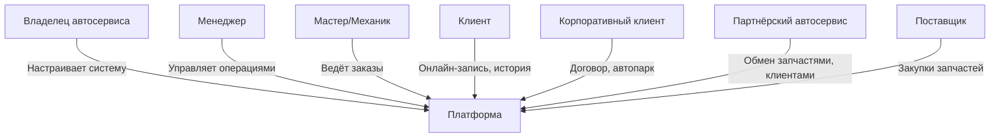
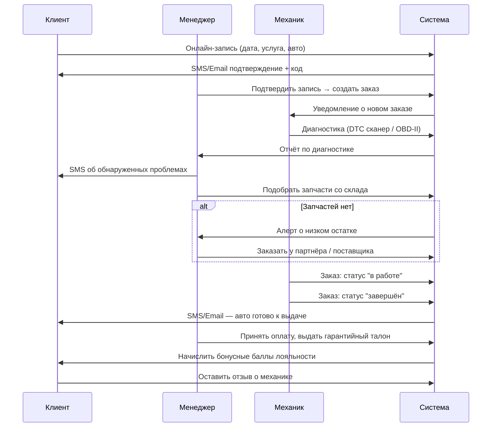
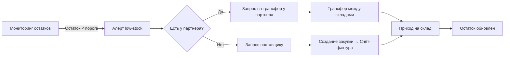
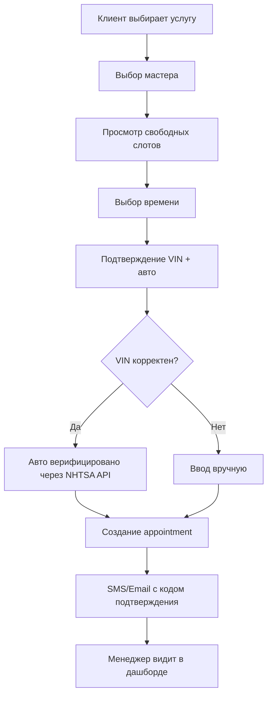

# Детальные бизнес-требования — AutoService Platform

> **Версия**: 2.0  
> **Дата**: 2026-02-22  
> **Статус**: В разработке

---

## 1. Обзор продукта

**AutoService Platform** — программное обеспечение для комплексной автоматизации автосервиса. Поставляется как **встроенное (embedded) решение**: любой автосервис устанавливает систему на собственный сервер, брендирует под себя (логотип, цвета, название) и использует полностью как свой продукт.

### Режимы развёртывания

| Режим | Описание | Целевая аудитория |
|-------|----------|-------------------|
| **Embedded (Single-tenant)** | Один автосервис — одна установка. Полный контроль над данными и брендингом. | Малый и средний бизнес |
| **Multi-branch** | Сеть филиалов одного автосервиса в одной установке. | Региональные сети |
| **White-label SaaS** | (Будущая версия) Несколько независимых автосервисов изолированы в одной установке. | Franchisor-модель |

---

## 2. Стейкхолдеры



### Матрица ролей и разрешений

| Действие | Владелец/admin | Менеджер | Механик | Клиент |
|----------|:-:|:-:|:-:|:-:|
| Управление настройками системы | ✅ | — | — | — |
| Управление сотрудниками | ✅ | ✅ | — | — |
| Просмотр всех заказов | ✅ | ✅ | свои | свои |
| Создание заказов | ✅ | ✅ | ✅ | ✅ |
| Смена статуса заказа | ✅ | ✅ | in_progress→completed | — |
| Управление складом | ✅ | ✅ | — | — |
| Онлайн-запись | ✅ | ✅ | — | ✅ |
| Просмотр аналитики | ✅ | ✅ | — | — |
| Управление скидками | ✅ | — | — | — |
| Управление партнёрами | ✅ | — | — | — |

---

## 3. Бизнес-процессы

### 3.1 Основной производственный цикл



### 3.2 Цикл управления запасами



### 3.3 Онлайн-запись клиента



---

## 4. Функциональные требования

### 4.1 White-label / Embedded конфигурация

**Модуль**: `TenantModule`  
**Endpoint**: `GET /tenant/branding` (публичный, без авторизации)

#### Настройки брендинга

| Параметр | Тип | Описание |
|----------|-----|----------|
| `companyName` | string | Название автосервиса |
| `tagline` | string | Слоган |
| `logoUrl` | string | URL логотипа (PNG/SVG) |
| `faviconUrl` | string | Иконка браузера |
| `primaryColor` | hex | Основной цвет интерфейса |
| `secondaryColor` | hex | Вторичный цвет |
| `accentColor` | hex | Акцентный цвет |
| `fontFamily` | string | Шрифт UI |

#### Контактная информация

| Параметр | Тип | Описание |
|----------|-----|----------|
| `address` | string | Физический адрес |
| `city` | string | Город |
| `phone` | string | Телефон горячей линии |
| `email` | string | Email поддержки |
| `workingHours` | string | Часы работы (показывается в хедере) |
| `mapCoordinates` | string | Координаты для карты |

#### Feature flags

| Флаг | По умолчанию | Описание |
|------|:-:|----------|
| `featureOnlineBooking` | ✅ | Онлайн-запись для клиентов |
| `featureVinDecoder` | ✅ | Декодирование VIN через NHTSA |
| `featureLoyaltyProgram` | ✅ | Программа лояльности |
| `featurePartnerNetwork` | ❌ | Партнёрская сеть (нужна настройка API) |
| `featureMultiBranch` | ❌ | Управление несколькими филиалами |
| `featureCorporateClients` | ❌ | Корпоративные клиенты и контракты |
| `featureSmsNotifications` | ❌ | SMS уведомления (нужен SMS.ru API ID) |
| `featureEmailNotifications` | ❌ | Email уведомления (нужен SMTP) |

**Алгоритм первоначальной настройки (Setup Wizard)**:
1. Администратор открывает `/setup` после установки
2. Заполняет данные компании → шаг 1
3. Настраивает брендинг (цвета, логотип) → шаг 2
4. Включает нужные features → шаг 3
5. Настраивает интеграции (SMS, Email) → шаг 4
6. `POST /tenant/settings/complete-setup` → установка считается завершённой

---

### 4.2 Управление заказами

**Статусы заказа**:
```
pending → confirmed → in_progress → quality_check → completed
                                                    ↓
                                                 cancelled
                                                 no_show
```

**Бизнес-правила**:
- Клиент может отменить заказ только в статусах `pending` / `confirmed`
- Переход `completed → ...` — запрещён
- При статусе `completed` автоматически:
  - Начисляются бонусные баллы (1 балл = 1 рубль суммы заказа по умолчанию)
  - Создаётся гарантийный талон (если настроено в услуге)
  - Освобождается временной слот (если был booking)
  - Отправляется SMS/Email клиенту

**Приоритеты заказа**: `low` | `normal` | `high` | `urgent`

---

### 4.3 Онлайн-запись (Booking)

**Модуль**: `BookingModule`

**Требования к слотам**:
- Слот = 60 минут по умолчанию (настраивается)
- Рабочие часы: 9:00–18:00 по умолчанию (настраивается из TenantSettings)
- Мастер не может иметь два пересекающихся активных слота
- Генерация слотов: `POST /booking/slots/generate` (admin/manager)

**Подтверждение**:
- Код подтверждения генерируется: 8 символов hex (uppercase)
- Отправляется SMS и Email при создании appointment
- QR-код (будущая версия)

---

### 4.4 Диагностика и история обслуживания

**Модуль**: `DiagnosticsModule`

**DTC каталог** (3000+ кодов):
- Стандарт OBD-II: P0xxx, P1xxx, C0xxx, B0xxx, U0xxx
- Сервисы P0xxx и P1xxx наиболее частые для легковых авто
- Данные для seed: [OBD2 codes база данных](https://github.com/myaresdk/obd2codes)

**Диагностическая сессия**:
- Привязана к автомобилю (VIN) и заказу
- Фиксирует пробег на момент диагностики
- Хранит raw данные от сканера (JSON)
- Результаты: список DTC кодов со статусами (active/history)

**Напоминания о ТО**:
- Создаются автоматически при завершении заказа (по типу услуги)
- Рассылаются автоматически за 7 дней до срока (cron: каждый день в 9:00)
- Типы: замена масла, ротация шин, тормоза, плановое ТО, ремень ГРМ

---

### 4.5 Уведомления

**Модуль**: `NotificationModule`

**Каналы**:

| Канал | Провайдер | Конфигурация |
|-------|-----------|-------------|
| SMS | SMS.ru | `SMS_RU_API_ID` в `.env` |
| Email | SMTP (любой) | `SMTP_HOST/PORT/USER/PASS/FROM` в `.env` |
| Push | (будущая версия) | FCM / APNs |

**Триггерные уведомления**:

| Событие | SMS | Email |
|---------|:---:|:-----:|
| Онлайн-запись подтверждена | ✅ | ✅ |
| Статус заказа изменён | ✅ | ✅ |
| Автомобиль готов к выдаче | ✅ | ✅ |
| Напоминание о ТО | ✅ | ✅ |
| Срок гарантии истекает | — | ✅ |
| Новый claim по гарантии | — | ✅ |

**Шаблоны уведомлений** (управляются через `POST /notifications/templates`):
- Переменные в формате `{{variable_name}}`
- Примеры: `{{customerName}}`, `{{orderNumber}}`, `{{status}}`, `{{date}}`

---

### 4.6 Гарантийная программа

**Модуль**: `WarrantyModule`

**Типы гарантий**:
- `work` — на выполненные работы (по умолчанию 6 месяцев)
- `spare_part` — на запчасти (зависит от производителя)
- `complex` — на весь заказ (работы + запчасти)

**Жизненный цикл**:
```
active → claimed (при подаче claim)
       → expired (по дате)
       → voided  (аннулирован вручную)
```

**Claim-процесс**:
1. Клиент подаёт claim через личный кабинет или менеджеру
2. Менеджер рассматривает → `under_review`
3. Менеджер принимает решение → `approved` / `rejected`
4. При approved — выполняются работы по гарантии → `resolved`

---

### 4.7 Аналитика и дашборд

**Модуль**: `AnalyticsModule`

**KPI дашборда (с периодами: today/week/month/year)**:
- Количество заказов (vs предыдущий период, %)
- Выручка (vs предыдущий период, %)
- Новые клиенты (vs предыдущий период, %)
- Средний рейтинг сотрудников

**Графики**:
- Выручка по месяцам (последние 12 месяцев) — для линейного графика
- Заказы по статусам — для круговой диаграммы
- Записи по дням (следующие 30 дней) — для календаря

**Таблицы**:
- Топ-10 услуг по количеству заказов
- Топ-10 сотрудников по количеству заказов + рейтингу
- Запчасти с низким остатком (порог настраивается)

---

### 4.8 Программа лояльности

**Модуль**: `PromotionsModule`

**Тиры (уровни)**:

| Тир | Порог накопленных баллов | Привилегии |
|-----|--------------------------|-----------|
| Bronze | 0 – 999 | Базовые скидки |
| Silver | 1 000 – 4 999 | +5% к начислению баллов |
| Gold | 5 000 – 9 999 | +10% к начислению, приоритетная запись |
| Platinum | 10 000+ | +20% к начислению, бесплатная диагностика |

**Правила начисления**:
- 1 рубль = 1 балл (настраивается)
- Начисляются при статусе `completed`
- Двойные баллы в день рождения (будущая версия)

**Промокоды**:
- Одноразовые (maxUsageCount = 1) или многоразовые
- По типу: процентная скидка / фиксированная сумма / бесплатная услуга
- Ограничение по сроку действия (startDate – endDate)
- Ограничение по минимальной сумме заказа

---

### 4.9 Партнёрская сеть

**Модуль**: `PartnersModule`

**Сценарии использования**:
1. **Обмен запчастями**: У автосервиса закончилась нужная деталь → запрос к партнёру
2. **Редирект клиента**: Клиент нуждается в узкоспециализированном ремонте → направление к партнёру
3. **Загруженность**: Слишком много заказов → перенаправить часть к партнёру

**API для партнёров**:
- API ключи (SHA-256 хеш, не хранится сам ключ)
- Scopes: read-only / read-write / specific-resource
- Ротация ключей: revoke + generate new

---

### 4.10 Корпоративные клиенты

**Модуль**: `CorporateModule`

**Структура**:
```
Company (компания)
  ├── CompanyContracts (договоры с условиями)
  │   ├── discountPercent — скидка по договору
  │   ├── creditLimit — кредитный лимит
  │   └── paymentTermDays — отсрочка платежа
  └── CompanyCars (автопарк, привязанные к компании авто)
```

**Бизнес-правила**:
- Скидка из контракта применяется автоматически к заказам сотрудников компании
- Кредитный лимит — задолженность не может превышать
- При завершении контракта — уведомление менеджеру

---

### 4.11 Мультифилиальность

**Модуль**: `BranchModule`

**Сценарии**:
- Сеть автосервисов в одном городе (3-5 точек)
- Каждый филиал: свои сотрудники, склад, расписание
- Общий пул запчастей с трансферами между складами
- Менеджер видит все филиалы, мастер — только свой

**Трансферы между складами**:
```
pending → in_transit → completed
                     → cancelled
```

---

### 4.12 VIN-декодер

**Модуль**: `VehicleModule`  
**Интеграция**: NHTSA vPIC API (бесплатно, без ключа)  
**Endpoint**: `https://vpic.nhtsa.dot.gov/api/vehicles/DecodeVinValues/{vin}?format=json`

**Возвращаемые данные**:
- Марка, модель, год выпуска
- Тип кузова, привод, тип двигателя
- Тип топлива, КПП
- Страна производства
- Тип ТС (легковой, грузовой, мотоцикл и т.д.)

**Валидация VIN**:
- Ровно 17 символов
- Допустимые: A-H, J-N, P-Z, 0-9 (без I, O, Q)

---

## 5. Технические требования

### 5.1 Стек технологий

| Компонент | Технология | Версия |
|-----------|-----------|--------|
| Backend | NestJS | 11.x |
| ORM | Drizzle ORM | 0.44+ |
| База данных | PostgreSQL | 16+ |
| Frontend | React | 19.x |
| Стейт менеджмент | RTK Query | 2.x |
| CSS | Tailwind CSS | v4 |
| Forms | React Hook Form + Zod | 7.x / 4.x |
| Auth | JWT + Google OAuth 2.0 | — |
| Scheduler | @nestjs/schedule | 6.x |
| Документация API | Swagger / OpenAPI | 3.x |

### 5.2 Переменные окружения

```env
# База данных
DB_HOST=localhost
DB_PORT=5432
DB_USER=postgres
DB_PASS=secret
DB_NAME=autoservice

# JWT
JWT_SECRET=your-secret-key
JWT_EXPIRES_IN=15m
JWT_REFRESH_SECRET=your-refresh-secret
JWT_REFRESH_EXPIRES_IN=7d

# Google OAuth
GOOGLE_CLIENT_ID=
GOOGLE_CLIENT_SECRET=
GOOGLE_CALLBACK_URL=http://localhost:3000/auth/google/callback

# SMS.ru (для SMS уведомлений)
SMS_RU_API_ID=

# SMTP (для Email уведомлений)
SMTP_HOST=smtp.gmail.com
SMTP_PORT=587
SMTP_USER=your@email.com
SMTP_PASS=
SMTP_FROM="АвтоСервис <noreply@example.com>"

# App
NODE_ENV=development
PORT=3000
FRONTEND_URL=http://localhost:5173
```

### 5.3 Структура API

| Префикс | Назначение |
|---------|-----------|
| `POST /auth/*` | Аутентификация |
| `GET/PUT/DELETE /api/v1.0/users/*` | Пользователи |
| `GET/POST/PUT/DELETE /api/v1.0/orders/*` | Заказы |
| `GET/POST /api/v1.0/employee/*` | Сотрудники |
| `GET/POST /api/v1.0/services/*` | Услуги |
| `GET/POST /api/v1.0/stores/*` | Склад |
| `GET/POST /api/v1.0/supplier/*` | Поставщики |
| `GET /api/v1.0/reports/*` | Отчёты |
| `GET/POST/PATCH /booking/*` | Онлайн-запись |
| `GET/POST /notifications/*` | Уведомления |
| `GET/POST/PATCH /diagnostics/*` | Диагностика |
| `GET/POST/PATCH /warranty/*` | Гарантии |
| `GET/POST/PATCH /partners/*` | Партнёры |
| `GET/POST/PATCH /branches/*` | Филиалы |
| `GET/POST/PATCH /corporate/*` | Корпклиенты |
| `GET/POST/PATCH /promotions/*` | Акции/лояльность |
| `GET /vehicle/vin/*` | VIN-декодер |
| `GET /analytics/*` | Аналитика |
| `GET/PUT /tenant/*` | Настройки системы |

### 5.4 База данных — полная схема сущностей (46 таблиц)

```mermaid
erDiagram
    USERS ||--o{ ORDERS : "создаёт"
    USERS ||--o{ CARS : "владеет"
    USERS ||--o{ APPOINTMENTS : "записывается"
    USERS ||--o{ REVIEWS : "пишет"
    USERS ||--o{ LOYALTY_PROGRAMS : "имеет"
    USERS ||--o{ NOTIFICATIONS : "получает"
    USERS ||--o{ MAINTENANCE_REMINDERS : "получает"
    CARS ||--o{ ORDERS : "в заказе"
    CARS ||--o{ APPOINTMENTS : "на записи"
    CARS ||--o{ DIAGNOSTIC_SESSIONS : "проходит диагностику"
    EMPLOYEES ||--o{ ORDERS : "ведёт"
    EMPLOYEES ||--o{ APPOINTMENTS : "назначен"
    EMPLOYEES ||--o{ TIME_SLOTS : "имеет"
    EMPLOYEES ||--o{ REVIEWS : "получает"
    EMPLOYEES ||--o{ BRANCH_EMPLOYEES : "работает в"
    ORDERS ||--o{ PAYMENTS : "оплачивается"
    ORDERS ||--o{ SERVICES_ORDERS : "включает услуги"
    ORDERS ||--o{ SPARE_PART_ORDERS : "использует запчасти"
    ORDERS ||--o{ WARRANTIES : "покрывается"
    ORDERS ||--o{ ORDER_DISCOUNTS : "со скидкой"
    SERVICES ||--o{ SERVICES_ORDERS : "заказывается"
    SERVICES }|--|| SERVICE_CATEGORIES : "категория"
    SPARE_PARTS ||--o{ SPARE_PART_ORDERS : "заказывается"
    SPARE_PARTS ||--o{ SPARE_PART_STORE : "хранится"
    SPARE_PARTS }|--|| CATEGORIES : "категория"
    STORES ||--o{ SPARE_PART_STORE : "хранит"
    BRANCHES ||--o{ BRANCH_EMPLOYEES : "имеет сотрудников"
    PARTNERS ||--o{ PARTNER_API_KEYS : "имеет ключи"
    PARTNERS ||--o{ PARTNER_SPARE_PART_REQUESTS : "запрашивает"
    COMPANIES ||--o{ COMPANY_CONTRACTS : "имеет контракты"
    COMPANIES ||--o{ COMPANY_CARS : "имеет автопарк"
    DISCOUNTS ||--o{ ORDER_DISCOUNTS : "применяется к"
    LOYALTY_PROGRAMS ||--o{ LOYALTY_TRANSACTIONS : "история"
    WARRANTY_CLAIMS }|--|| WARRANTIES : "по гарантии"
    DIAGNOSTIC_SESSIONS ||--o{ DIAGNOSTIC_RESULTS : "выявляет"
    DIAGNOSTIC_RESULTS }|--|| DIAGNOSTIC_CODES_CATALOG : "код"
    NOTIFICATION_TEMPLATES ||--o{ NOTIFICATIONS : "по шаблону"
```



---

## 6. Нефункциональные требования

### 6.1 Производительность
- Время ответа API: < 200ms для 95% запросов
- Список заказов (1000+ записей): < 500ms
- Генерация отчётов: < 3 сек
- Одновременных пользователей: до 100 (single-tenant)

### 6.2 Безопасность
- Пароли: bcrypt (rounds = 12)
- JWT access token: 15 минут
- JWT refresh token: 7 дней (ротация при использовании)
- API ключи партнёров: SHA-256 хеш (сырой ключ не хранится)
- Rate limiting: 100 req/min per IP (рекомендуется Nginx)
- HTTPS обязателен в продакшне

### 6.3 Масштабируемость
- Горизонтальное масштабирование: поддерживается через stateless JWT
- Database connection pool: PG max 20 соединений
- Индексы на все FK и часто используемые фильтры

### 6.4 Доступность
- Backup: ежедневный PostgreSQL dump (pg_dump)
- Логирование: stderr + файл (рекомендуется Winston/Pino)
- Health check endpoint: `GET /health`

---

## 7. Дорожная карта

### ✅ v1.0 — Реализовано (MVP)
- Аутентификация (JWT + Google OAuth)
- CRUD пользователей, сотрудников, заказов
- Каталог услуг и запчастей
- Управление складом
- Базовые отчёты (5 типов)
- Подписки на доступность мастеров

### ✅ v2.0 — Реализовано
- Онлайн-запись с временными слотами
- История обслуживания и диагностика (DTC)
- Гарантийная программа
- Система уведомлений (SMS + Email)
- VIN-декодер (NHTSA API)
- Программа лояльности
- Промокоды и скидки
- Напоминания о ТО (автоматические cron)
- Аналитический дашборд с KPI

### ✅ v3.0 — Реализовано
- Партнёрская сеть (обмен запчастями и клиентами)
- Мультифилиальность
- Корпоративные клиенты и контракты

### ✅ v4.0 — White-label / Embedded
- Конфигуратор брендинга (TenantModule)
- Feature flags (включение/отключение модулей)
- Первоначальный Setup Wizard
- Кастомные страницы (About, Privacy Policy и т.д.)
- Email-уведомления с HTML шаблонами

### 🔮 v5.0 — Планируется
- [ ] Мобильное приложение (React Native)
- [ ] Интеграция с онлайн-кассой (54-ФЗ)
- [ ] Интеграция с 1С Бухгалтерия
- [ ] QR-коды для заказов и гарантийных талонов
- [ ] Клиентский портал (отдельная точка входа)
- [ ] Telegram-бот для уведомлений
- [ ] OBD-II Bluetooth интеграция (мобильное приложение)
- [ ] AI-ассистент для диагностики (на основе DTC + история)
- [ ] Видеофиксация приёмки авто
- [ ] Электронная подпись документов
- [ ] Multi-tenant SaaS (franchise-модель)

---

## 8. Интеграции

| Сервис | Назначение | Статус | Конфигурация |
|--------|-----------|--------|-------------|
| **NHTSA vPIC API** | VIN-декодер | ✅ Реализовано | Бесплатно, без ключа |
| **SMS.ru** | SMS-уведомления | ✅ Реализовано | `SMS_RU_API_ID` |
| **SMTP (любой)** | Email-уведомления | ✅ Реализовано | `SMTP_*` переменные |
| **Google OAuth 2.0** | Авторизация | ✅ Реализовано | `GOOGLE_CLIENT_*` |
| **Stripe** | Онлайн-оплата | 🔮 Планируется | — |
| **Telegram Bot API** | Push-уведомления | 🔮 Планируется | — |
| **1С** | Бухгалтерия | 🔮 Планируется | — |
| **ОФД / Касса** | 54-ФЗ | 🔮 Планируется | — |

---

## 9. Deployment

### Docker Compose (рекомендуемый способ)

```yaml
version: '3.8'
services:
  postgres:
    image: postgres:16-alpine
    environment:
      POSTGRES_DB: autoservice
      POSTGRES_USER: postgres
      POSTGRES_PASSWORD: ${DB_PASS}
    volumes:
      - postgres_data:/var/lib/postgresql/data
    ports:
      - "5432:5432"

  backend:
    build: ./server
    environment:
      DB_HOST: postgres
      DB_PORT: 5432
      DB_NAME: autoservice
      DB_USER: postgres
      DB_PASS: ${DB_PASS}
      JWT_SECRET: ${JWT_SECRET}
      NODE_ENV: production
    depends_on:
      - postgres
    ports:
      - "3000:3000"

  frontend:
    build: ./frontend
    environment:
      VITE_API_URL: http://backend:3000
    ports:
      - "80:80"

volumes:
  postgres_data:
```

### Первый запуск

```bash
# 1. Установить зависимости
cd server && npm install
cd ../frontend && npm install

# 2. Создать .env файлы (скопировать из .env.example)
cp server/.env.example server/.env
cp frontend/.env.example frontend/.env

# 3. Запустить PostgreSQL
docker-compose up postgres -d

# 4. Применить миграции
cd server && npm run db:migrate

# 5. Заполнить начальные данные (роли, DTC коды)
cd server && npm run db:seed

# 6. Запустить в режиме разработки
cd server && npm run start:dev
cd frontend && npm run dev

# 7. Открыть Setup Wizard
# http://localhost:5173/setup
```

---

## 10. Архитектурные решения (ADR)

### ADR-001: UUID вместо BIGSERIAL для первичных ключей
**Решение**: Все PK — UUID v4 (defaultRandom)  
**Причина**: Нет предсказуемых ID в URL, безопасно для API, удобно при слиянии данных из разных установок

### ADR-002: Drizzle ORM вместо TypeORM/Prisma
**Решение**: Drizzle ORM + drizzle-kit  
**Причина**: Нативный SQL-стиль, нет рантаймовой рефлексии, быстрый, типобезопасный

### ADR-003: Single tenant (embedded) архитектура
**Решение**: Одна установка = один автосервис  
**Причина**: Простота развёртывания и владения данными. Multi-tenancy планируется в v5.0

### ADR-004: JWT без сессий на сервере
**Решение**: Stateless JWT + refresh token rotation в БД  
**Причина**: Горизонтальное масштабирование без Redis

### ADR-005: Feature flags в TenantSettings
**Решение**: Boolean колонки в TenantSettings, читаются через `GET /tenant/branding`  
**Причина**: Простота управления, не требует отдельной redis/config-server инфраструктуры
